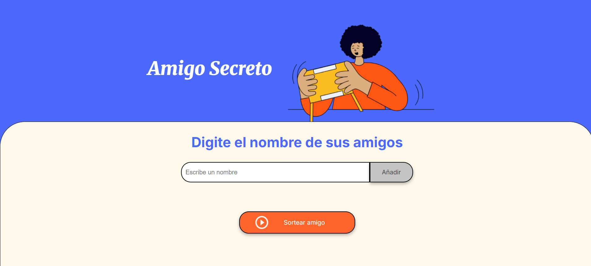
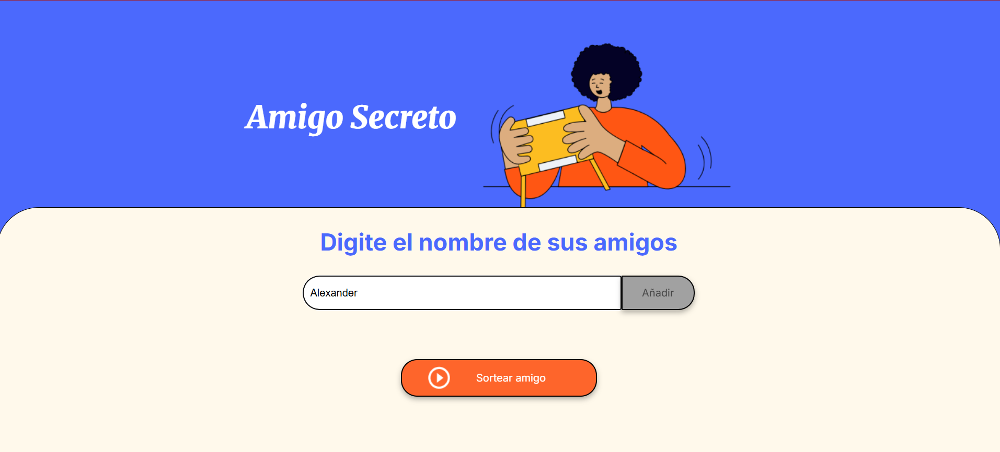
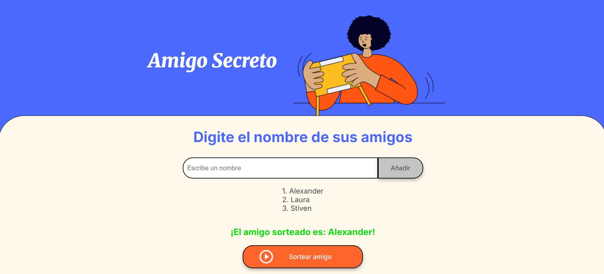

<!DOCTYPE html>
<html lang="es">
<head>
    <meta charset="UTF-8">
    <meta name="viewport" content="width=device-width, initial-scale=1.0">
    <link rel="stylesheet" href="CSS/styleReadme.css">

</head>
<body>
    <h1>Amigo Secreto</h1>
    

        ¡Bienvenido al proyecto <strong>Amigo Secreto</strong>! Esta es una aplicación web sencilla que te permite organizar un sorteo entre tus amigos. Puedes agregar nombres, ver la lista de participantes y realizar un sorteo aleatorio para seleccionar un ganador.
    

    <h2>Funcionalidades</h2>
    <ul>
        <li><strong>Agregar nombres</strong>: Ingresa los nombres de tus amigos en el campo de texto. Solo se permiten nombres válidos (sin números ni caracteres especiales).</li>
        <li><strong>Ver lista de participantes</strong>: Los nombres agregados se muestran en una lista ordenada.</li>
        <li><strong>Realizar sorteo</strong>: Haz clic en el botón "Sortear" para seleccionar un amigo secreto al azar. El resultado se muestra en la pantalla.</li>
        <li><strong>Validación de entrada</strong>: El programa valida que no se ingresen números o campos vacíos.</li>
    </ul>
    <h2>Capturas de Pantalla</h2>
    <h3>1. Interfaz Principal</h3>
    
    
Captura de la interfaz principal del proyecto.

    <h3>2. Agregar Nombres</h3>
    
    
Captura mostrando cómo agregar nombres a la lista.

    <h3>3. Resultado del Sorteo</h3>
    
    
Captura del resultado del sorteo.

    <h2>Cómo Usar</h2>
    <ol>
        <li><strong>Clona el repositorio</strong>:
            <pre><code>git clone https://github.com/Redz0x/juego-amigo-secreto.git</code></pre>
        </li> 
        <li><strong>Abre el proyecto</strong>:
            <pre><code>cd amigo-secreto</code></pre>
            Abre el archivo <code>index.html</code> en tu navegador.
        </li>
        <li><strong>Agrega nombres</strong>:
            Escribe el nombre de un amigo en el campo de texto y haz clic en "Añadir". Repite este paso para agregar más nombres.
        </li>
        <li><strong>Realiza el sorteo</strong>:
            Cuando hayas agregado todos los nombres, haz clic en "Sortear" para obtener un resultado aleatorio.
        </li>
    </ol>
    <h2>Tecnologías Utilizadas</h2>
    <ul>
        <li><strong>HTML</strong>: Estructura de la página.</li>
        <li><strong>CSS</strong>: Estilos y diseño.</li>
        <li><strong>JavaScript</strong>: Lógica del programa (validación, sorteo, etc.).</li>
    </ul>
    <h2>Estructura del Proyecto</h2>
    <pre>
amigo-secreto/
│
├── index.html          # Archivo principal HTML
├── css/                # Carpeta para estilos CSS
│   └── styleReadme.css      # Archivo de estilos CSS README.md
├── js/                 # Carpeta para scripts JavaScript
│   └── app.js          # Archivo de lógica JavaScript
├── assets/             # Carpeta de recursos (imágenes, etc.)
│   └── amigo-secreto.png
├── screenshots/        # Capturas de pantalla
│   ├── main-interface.png
│   ├── add-names.png
│   └── draw-result.png
└── README.md           # Archivo README (este archivo)
    </pre>
    <h2>Cómo Contribuir</h2>
    

        ¡Tu contribución es bienvenida! Si deseas mejorar este proyecto, sigue estos pasos:
    

    <ol>
        <li>Haz un <strong>fork</strong> del repositorio.</li>
        <li>Crea una nueva rama (<code>git checkout -b nueva-funcionalidad</code>).</li>
        <li>Realiza tus cambios y haz commit (<code>git commit -m 'Agrega nueva funcionalidad'</code>).</li>
        <li>Haz push a la rama (<code>git push origin nueva-funcionalidad</code>).</li>
        <li>Abre un <strong>Pull Request</strong> en GitHub.</li>
    </ol>
    <h2>Licencia</h2>
    

        Este proyecto está bajo la licencia <strong>MIT</strong>. Para más detalles, consulta el archivo <a href="LICENSE">LICENSE</a>.
    

    <h2>Autor</h2>
    

        - <strong>Nombre</strong>: Alexánder Cardona 
        - <strong>GitHub</strong>: <a href="https://github.com/Redz0x/">@Redz0x</a> 
        - <strong>Correo</strong>: jalexpeca@gmail.com 
        - <strong>Enlace al aplicativo</strong>: <a href="https://redz0x.github.io/juego-amigo-secreto/">Amigo Secreto</a> 
    

</body>
</html>
